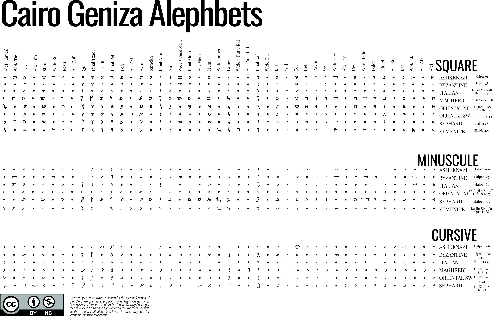

### Geniza Image Resources

- [Genizah Fragments at the Bodleain Libraries](https://genizah.bodleian.ox.ac.uk/)
- [Princeton Geniza Project](https://geniza.princeton.edu/pgp/index.php?a=image)
- [The Friedberg Genizah Project](https://fjms.genizah.org/?lang=eng)
- [The Rylands Cairo Genizah Collection at the University of Manchester Library](http://www.rylandsgenizah.org/)
- [University of Cambridge Library Cairo Genizah Cairo Genizah Collection](https://cudl.lib.cam.ac.uk/collections/genizah)
- [University of Pennsylvania Libraries Cairo Genizah Collection](http://openn.library.upenn.edu/html/genizah_contents.html)

--- 

### Geniza Paleography Resources

- [Cairo Geniza Alphabet Chart](https://github.com/judaicadh/cairogeniza/tree/master/_docs/Eckstein%20Alephbet%20Chart) 
 
 
----
****